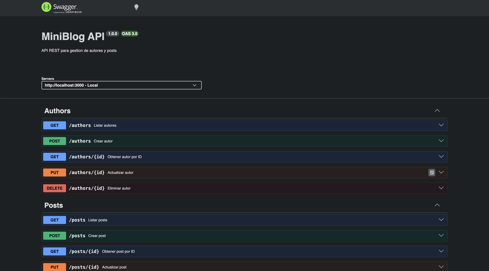

# 📝 MiniBlog REST API

API REST para gestionar **autores y publicaciones**, desarrollada con Node.js, Express y PostgreSQL.

El proyecto implementa operaciones CRUD, persistencia en base de datos, manejo de errores, documentación con OpenAPI/Swagger y una suite de pruebas automatizadas.

## 📸 Documentación de la API



## 🚀 Funcionalidades

### Autores
- Crear autores.
- Obtener todos los autores.
- Obtener un autor por ID.
- Actualizar autores.
- Eliminar autores.

### Publicaciones
- Crear publicaciones.
- Obtener todas las publicaciones.
- Obtener una publicación por ID.
- Obtener publicaciones por autor.
- Actualizar publicaciones.
- Eliminar publicaciones.

### API
- Persistencia con PostgreSQL.
- Validación y manejo de errores.
- Respuestas HTTP `400` y `404`.
- Documentación interactiva con Swagger UI.
- Especificación OpenAPI.
- Datos iniciales mediante seed.
- Tests automatizados.

## 🛠️ Tecnologías

- Node.js
- Express 5
- PostgreSQL
- `pg`
- Jest
- Supertest
- OpenAPI
- Swagger UI
- dotenv

## 🧪 Testing

El proyecto cuenta con **19 pruebas automatizadas** desarrolladas con Jest y Supertest.

Las pruebas cubren:

- CRUD de autores.
- CRUD de publicaciones.
- Validaciones.
- Casos de error `400`.
- Recursos inexistentes `404`.

Ejecutar los tests:

```bash
npm test
```

Resultado:

```text
19/19 tests passing
```

## 📚 Documentación OpenAPI

La especificación completa se encuentra en:

```text
docs/openapi.yaml
```

Con el servidor ejecutándose, Swagger UI está disponible en:

```text
http://localhost:3000/api-docs
```

## 🔗 Endpoints

### Health

```http
GET /health
```

### Autores

```http
GET    /authors
GET    /authors/:id
POST   /authors
PUT    /authors/:id
DELETE /authors/:id
```

### Publicaciones

```http
GET    /posts
GET    /posts/:id
GET    /posts/author/:authorId
POST   /posts
PUT    /posts/:id
DELETE /posts/:id
```

## ⚙️ Instalación local

### 1. Clonar el repositorio

```bash
git clone https://github.com/GonzaloB1/blog-api-rest.git
cd blog-api-rest
```

### 2. Instalar dependencias

```bash
npm install
```

### 3. Crear la base de datos

```sql
CREATE DATABASE miniblog;
```

### 4. Crear tablas y cargar datos iniciales

Desde PostgreSQL:

```sql
\i /ruta/al/proyecto/blog-api-rest/src/db/setup.sql
```

El archivo `setup.sql` contiene el esquema y los datos iniciales necesarios para ejecutar el proyecto.

### 5. Configurar variables de entorno

Crear un archivo `.env`:

```env
PORT=3000

DB_HOST=localhost
DB_PORT=5432
DB_NAME=miniblog
DB_USER=tu_usuario
DB_PASSWORD=tu_password

NODE_ENV=development
```

### 6. Iniciar la API

```bash
npm start
```

Servidor:

```text
http://localhost:3000
```

Swagger:

```text
http://localhost:3000/api-docs
```

## 🗄️ Base de datos

La aplicación utiliza PostgreSQL para almacenar autores y publicaciones.

El script:

```text
src/db/setup.sql
```

permite crear las tablas y cargar los datos iniciales necesarios para probar la API.

## 🧠 Decisiones técnicas

### PostgreSQL

Se utilizó PostgreSQL como base de datos relacional para mantener persistencia real de autores y publicaciones.

### Script de inicialización

El esquema y los datos de prueba se centralizaron en `setup.sql`, simplificando la preparación del entorno local.

### Swagger / OpenAPI

La API cuenta con documentación interactiva mediante Swagger UI, permitiendo visualizar y probar los endpoints desde el navegador.

### Testing

Jest y Supertest permiten probar los endpoints HTTP y validar tanto operaciones exitosas como distintos casos de error.

## ☁️ Deploy

El proyecto fue desplegado originalmente utilizando Railway junto con una instancia PostgreSQL.

Railway se configuró para utilizar las variables de conexión proporcionadas por el servicio PostgreSQL y realizar despliegues desde el repositorio de GitHub.

> El despliegue público puede no estar disponible actualmente. El proyecto puede ejecutarse completamente de forma local siguiendo los pasos de instalación.

## 🤖 Uso de IA

Durante el desarrollo se utilizó **Claude (Anthropic)** como asistente para apoyar distintas etapas del proyecto.

Entre los principales usos:

- Diseño progresivo de la API y flujo de trabajo con Git.
- Diagnóstico de secuencias `SERIAL` de PostgreSQL.
- Configuración de PostgreSQL y variables de entorno.
- Creación y mejora de la suite de pruebas.
- Integración de Swagger UI y OpenAPI.
- Configuración del despliegue en Railway.
- Revisión del script `setup.sql`.
- Resolución de errores durante el desarrollo.

Las soluciones propuestas fueron implementadas y posteriormente verificadas mediante pruebas automatizadas y pruebas manuales de la API.

## 📚 Aprendizajes

Este proyecto permitió profundizar en:

- Diseño de APIs REST.
- Node.js y Express.
- PostgreSQL y SQL.
- Operaciones CRUD.
- Manejo de errores HTTP.
- Variables de entorno.
- Testing de APIs.
- Jest y Supertest.
- Documentación OpenAPI.
- Swagger UI.
- Deploy de backend y base de datos.

## 👨‍💻 Autor

**Gonzalo Bastias**

Frontend Developer Jr. | React · TypeScript · Node.js

- GitHub: GonzaloB1
- LinkedIn: Gonzalo Bastias